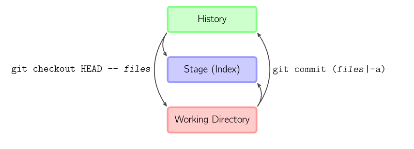
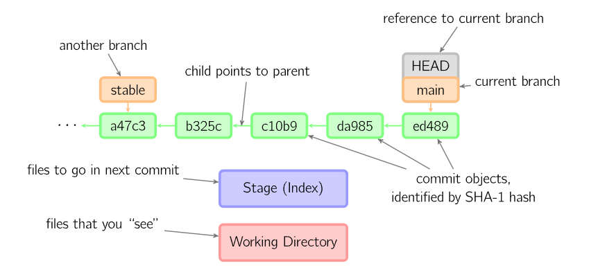

# **Versionamento com Git e Github**

## **Tópicos**

1. **O que é Git e Github?**
2. **Git na prática**
3. **Github na prática**
4. **BONUS: Markdown**

<br>

## **Referências Utilizadas**

### **Docs**

- [Documentação Oficial - Git](https://git-scm.com/docs)

- [Pro Git - Scott Chacon & Ben Straub (Livro - Tutorial)](https://git-scm.com/book/en/v2)

- [Uma Referência Visual do Git - Mark Lodato](https://marklodato.github.io/visual-git-guide/index-pt.html)

- [Documentação Oficial - Github](https://docs.github.com/en)

### **Tutoriais**

- [Tutorial de Git em 2h30min - Bonieki Lacerda](https://youtu.be/OuOb1_qADBQ)

### **Cursos**

- [Rocketseat - Guia Estelar de Git](https://app.rocketseat.com.br/node/o-guia-estelar-de-git)
- [Rocketseat - Guia Estelar de Github](https://app.rocketseat.com.br/node/o-guia-estelar-de-git-hub)

### **Outros**

- [Markdown](https://www.markdownguide.org/getting-started/)
- [Conventional Commits](https://www.conventionalcommits.org/en/v1.0.0/)

<br>

## 1) O que é Git e Github?

<br>

### **Tipos de Controle de Versão**

VCS - Version Control System

1. **Sistemas Locais**

- Mais simples, baixíssimo controle sobre as alterações na história do projeto
- Muito propensa a erros
- RCS - Revision Control System
  - Modelo mais sofisticado e mais completo de um sistema local comum

2. **Sistemas Centralizados**

- Um único servidor contém os arquivos do controle de versão
- Permite a colaboração de vários desenvolvedores mutuamente
- Se o servidor cai, perde-se o acesso aos arquivos do projeto
- Se o disco rígido que contém o banco de dados central for corrompido, o projeto todo pode ser perdido

3. **Sistemas Distribuídos**

- Onde encontra-se o Git
- Duplicação (clonagem) do repositório localmente, ou seja, cada desenvolvedor possui uma cópia do projeto na máquina local
- Quando uma alteração precisa ser feita, o desenvolvedor empurra essa alteração para um ramo do projeto localmente e depois para alguma nuvem (_Github_)

### **Git**

- Controle de versão de arquivos distribuído
- Open-source
- Permite construir um histórico de alterações dos arquivos de um projeto para um maior domínio sobre ele
- É baseado em pontos na história que o desenvolvedor cria (_commits_)
- **Vantagens:**
  - Marcar versões específicas na história do projeto
  - Reverter para um estado anterior determinados arquivos ou um projeto inteiro
  - Comparação das mudanças ao longo do tempo
  - Controle sobre novas funcionalidades (_branches_)

### **Github**

- Plataforma para hospedagem de código-fonte em repositórios com controle de versão git
- Comunidade com vários projetos e desenvolvedores
  - Contribuição com projetos open-source

<br>

## 2) Git na prática

<br>

### **Setup do Git**

[Instalando o Git (Vídeo)](https://youtu.be/OuOb1_qADBQ?t=910)

[Configurando o Git (Vídeo)](https://youtu.be/OuOb1_qADBQ?t=1302)

[Instalando o Git (Referência Oficial)](https://git-scm.com/book/en/v2/Getting-Started-Installing-Git)

[Configurando o Git (Referência Oficial)](https://git-scm.com/book/en/v2/Getting-Started-First-Time-Git-Setup)

<br>

### **Git "por trás das cortinas"**

- Alguns termos do Git
  - Commit -> Ponto na História
  - Branch -> Ramificação
  - HEAD -> Ponteiro que mostra qual commit está sendo observado
- As estruturas do Git



1. **Working Directory:** arquivos trabalhados no momento
   - Também conhecido como _Working Tree_
2. **Stage Area:** estágio cujo os arquivos estão preparados para o _commit_, esse estágio é atingido pelo comando _git add_
   - Também conhecido como _Stage Index_
3. **Local Repository:** destino final dos arquivos; estágio atingido pelo _git commit_

- Esquema prático organizacional do Git



<br>

### **Fazendo Alterações Locais**

1. Inicializando um repositório localmente

```bash
# No diretório que irá comportar o projeto
git init
```

2. Adicionando os arquivos do diretório para a _Stage Area (Index)_

```bash
# O argumento '.' adiciona todos os arquivos do diretório atual
git add .
```

3. Fazendo seu primeiro _commit_

```bash
# A flag '-m' sinaliza que uma mensagem será adicionada em seguida
git commit -m 'sua mensagem'
```

4. Visualizando seus pontos na história (_commit_) do ramo (_branch_)

```bash
# Exibir o histórico de forma detalhada
git log

# Exibir o histórico de forma sucinta
git log --oneline
```

### **Desfazendo Alterações Locais**

1. Desfazendo o último _commit_

```bash
# O comando desfaz o último commit como se ele nunca tivesse sido feito
git commit --amend
```

2. Tirando arquivos da _Stage Area_

```bash
# Apenas o arquivo especificado sai da Stage Area e volta para a Working Tree
git restore --staged <arquivo>

# Outra alternativa
git rm --staged <arquivo>
```

3. Removendo arquivos não rastreados da _Working Tree_

```bash
# A flag '-n' mostra quais são os arquivos a serem limpados
# A flag '-f' força a limpeza e deleta esses arquivos
git clean
```

4. Revertendo um _commit_ quando a _Working Tree_ está limpa

```bash
# Cria um novo commit marcando a reversão como um ponto na história
git revert HEAD~(número_do_commit)

# Outra maneira
git revert (hash)
```

### **Verificando Modificações**

```bash
# Compara o arquivo do Repositório Local com a Working Tree
git diff <arquivo(argumento opcional)>
```

### **Enviando e Recebendo Arquivos da Nuvem**

1. Clonando um repositório direto da nuvem

```bash
# O link do projeto é obtido diretamente do http:// na URL
git clone <link_do_projeto>
```

2. Empurrando as alterações para a nuvem

```bash
# O comando só será executado caso você tenha acesso ao repositório como contribuinte ou caso seja o dono do projeto
git push <nome_da_branch_remota> <branch_local>
```

4. Puxando as alterações da nuvem

```bash
# É sempre bom puxar as alterações da nuvem antes de começar a trabalhar em qualquer código
git pull <nome_da_branch_remota> <branch_local>
```

<br>

## 3) Github na prática

<br>

### **Setup do Github**

[Criando um Repositório (Vídeo)](https://www.youtube.com/watch?v=OuOb1_qADBQ&t=1302s)

[Conectando o Repositório Local ao Remoto (Vídeo)](https://youtu.be/OuOb1_qADBQ?t=5590)

[Conta e Perfil (Referência Oficial)](https://docs.github.com/en/account-and-profile)

[Início Rápido (Referência Oficial)](https://docs.github.com/en/get-started/quickstart)

[Criando a chave SSH (Referência Oficial)](https://docs.github.com/en/authentication/connecting-to-github-with-ssh/generating-a-new-ssh-key-and-adding-it-to-the-ssh-agent)

<br>

### **Projetos / Empresas interessantes disponíveis no Github**

[freeCodeCamp - Top 1 em estrelas](https://github.com/freeCodeCamp/freeCodeCamp)

[developer-roadmap](https://github.com/kamranahmedse/developer-roadmap)

[Google](https://github.com/google)

[Meta](https://github.com/facebook)

[Python](https://github.com/python)

<br>

## 4) BONUS: Markdown

<br>
